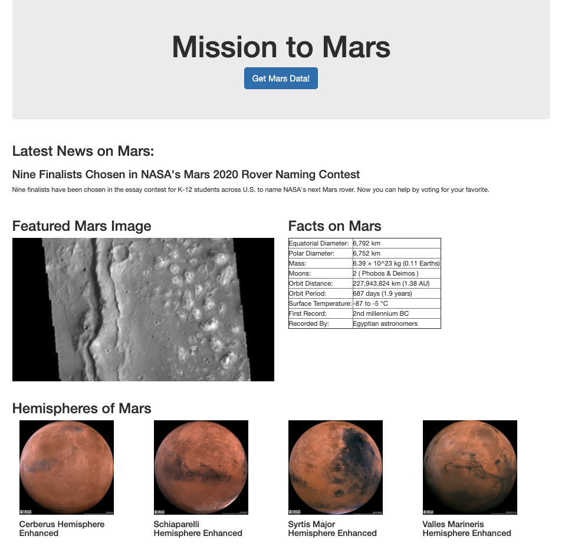

# web-scraping-challenge

## Description
We have been tasked to build a web application that scrapes various websites that provide data related to Mars and display the collected data in a single HTML page.

## How to Run Code
Clone this repository, locate and open the app.py file, run code in terminal, and run the Flask app. Click "Get Mars Data!" to proceed with web scraping and view resulting data. To see the web scraping process, run the mission_to_mars Jupyter notebook. 

## Results
The resulting view of the scraped data is shown below:

* The latest news will reflect the title and teaser of the most recent news from the following site: https://redplanetscience.com/ 

* The featured Mars image will reflect the featured image from the following site: https://spaceimages-mars.com/ 

* The facts on Mars displays Mars planet profile information scraped from the following site: https://galaxyfacts-mars.com/
 
* The hemispheres of Mars information comes from the following site: https://marshemispheres.com/ and the user may click into each hemisphere thumbnail to view enlarged image
